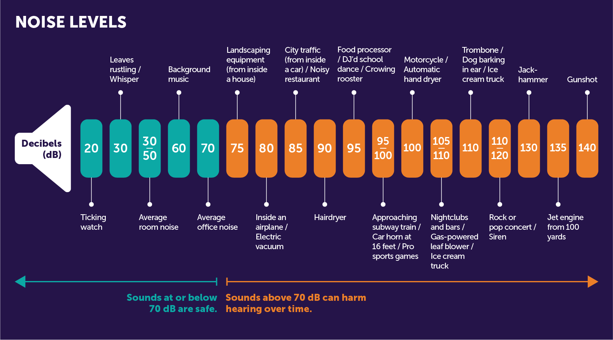

# Interactive-Noise-Mapping

## Objective: 

The objective of this noise mapping platform is to furnish reliable and actionable acoustic data that architects, urban planners, and local residents can utilize.

Our aim is to present a clear picture of the ambient noise levels within the region in question. By doing so, we intend to empower stakeholders with the necessary insights to make informed decisions regarding urban design, residential development, and community living spaces. The platform is not just a repository of information but a tool for enhancing the quality of life by mitigating noise pollution through strategic planning and design.

## Data presentation: 
Our project is dedicated to delivering a comprehensive and user-friendly noise mapping interface. The platform represents sound levels in decibels, recorded during both **daytime and nighttime** to capture the full scope of auditory environments. 

Each data point is geographically anchored with precise longitude and latitude coordinates, alongside the designation of the location's name for ease of identification. Furthermore, the platform categorizes the noise by its sources — such as traffic, construction, or public activities — and annotates the data with the month in which it was captured to track temporal noise variations. 

To offer a detailed understanding, we provide the maximum, minimum, and average noise levels for a nuanced analysis. Upon this analysis, our platform goes a step further: it generates tailored recommendations based on the noise level humans can tolerate naturally without creating damages to the ear.



These suggestions aim to support **urban development, guide policy-making for noise regulation, and assist residents with informed decision-making**. Our ultimate goal is to transform data into actionable insights for a quieter, more peaceful urban experience.


## Run Locally

Clone the project

```bash
  git clone https://github.com/Sherryzh0830/Interactive-Noise-Mapping.git
```


Input your own custom directory in `psuedomap.py`
```
save_directory = ""  #input custom directory path
```
```
file_path = "" #input your own custom file path directory
```
## Authors

- [@caroline430](https://github.com/caroline430)
- [@chenz623](https://github.com/chenz623)
- [@rachelmyl](https://github.com/rachelmyl)
- [@Sherryzh0830](https://github.com/Sherryzh0830)
